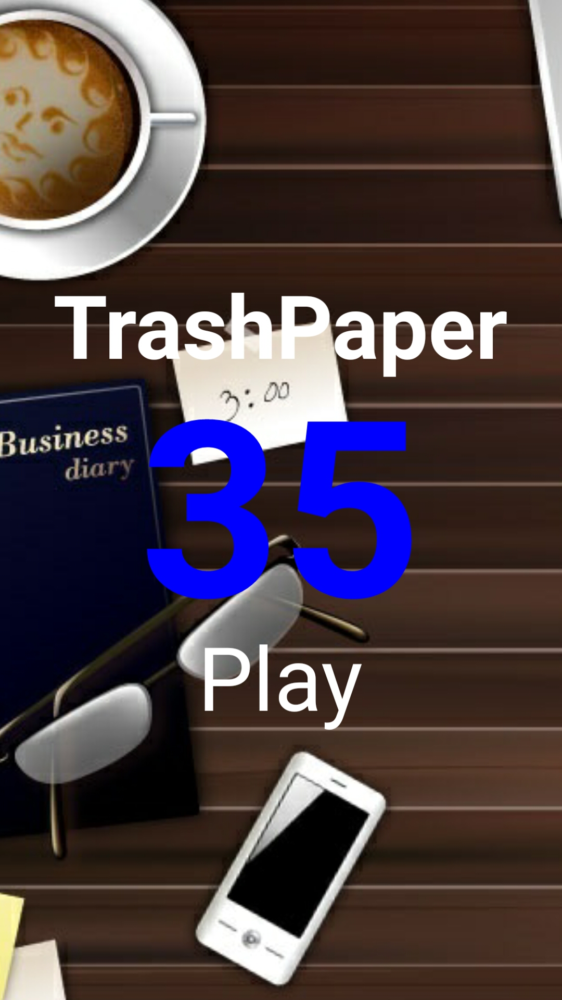
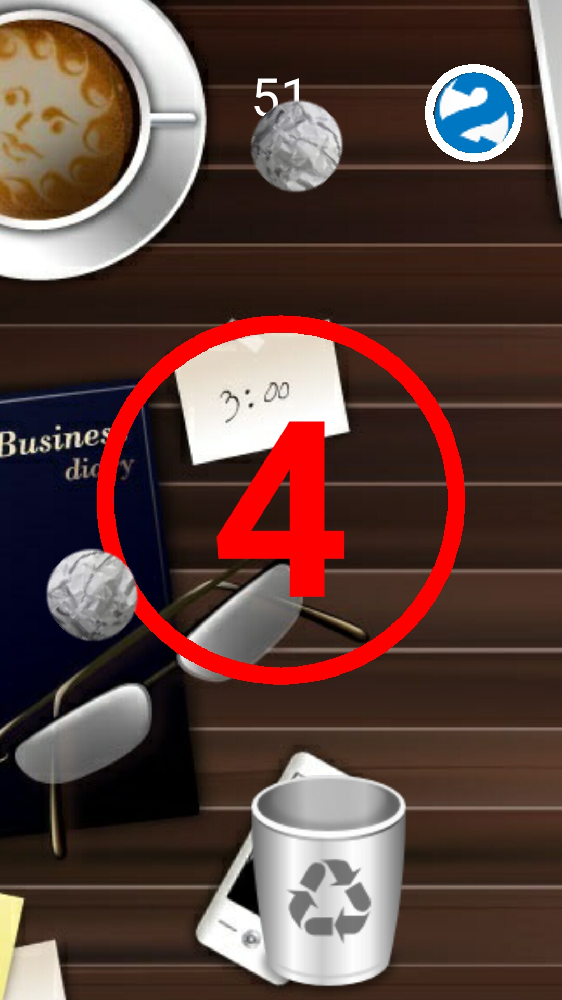
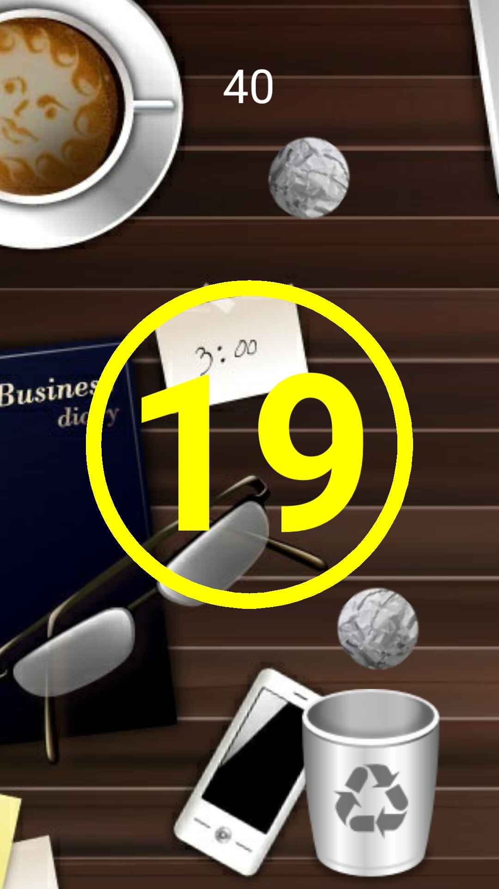

# TrashPaper

TrashPaper is a simple game build with corona SDK using lua programing language,
Try to catch the papers ball with the trash can.

## Screenshot

 

 

 
 
 
 ## Download
 
 Version 1.0.1
 
 